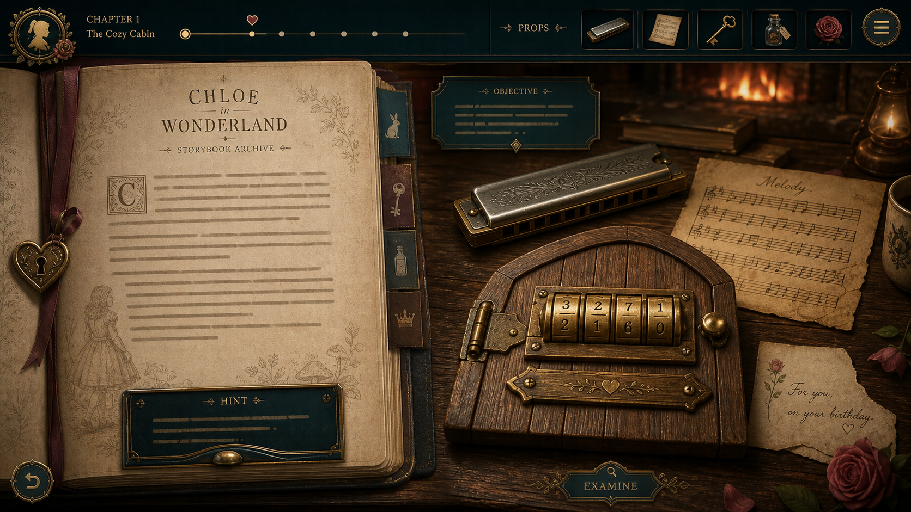
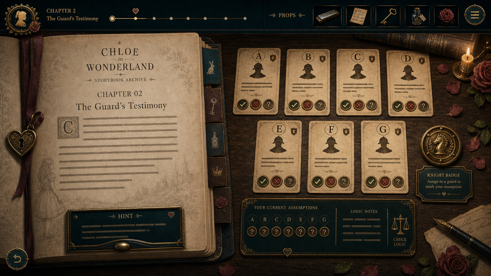
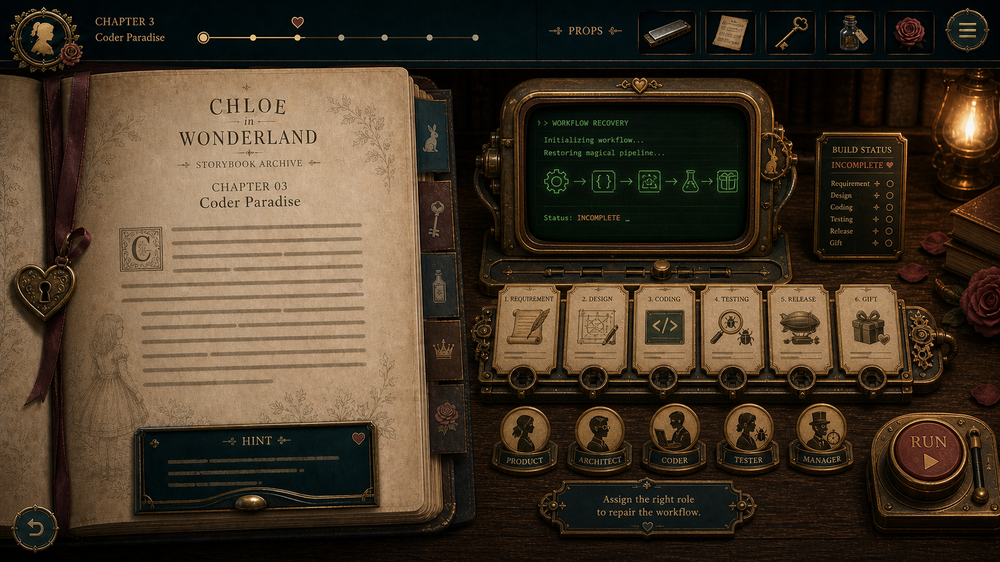
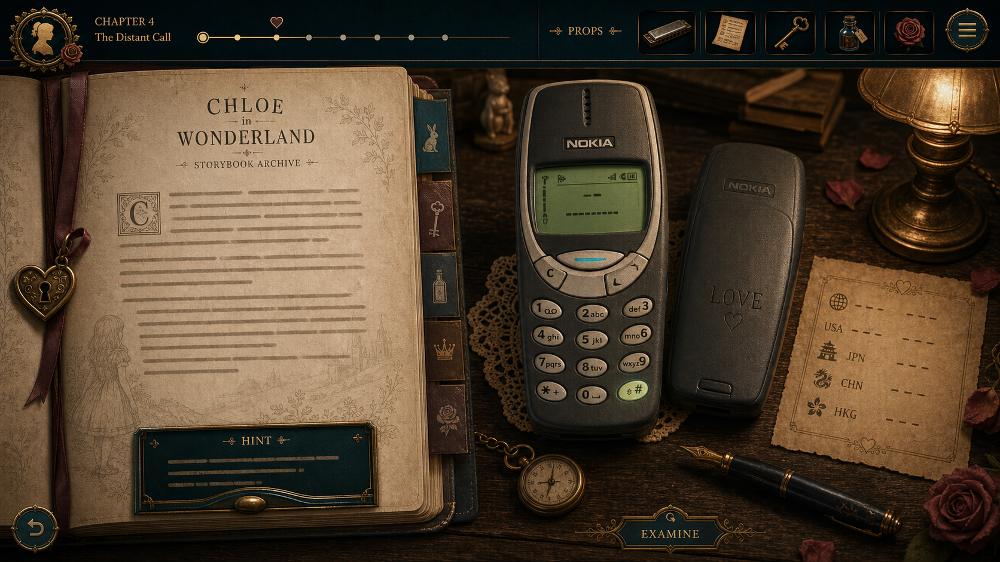
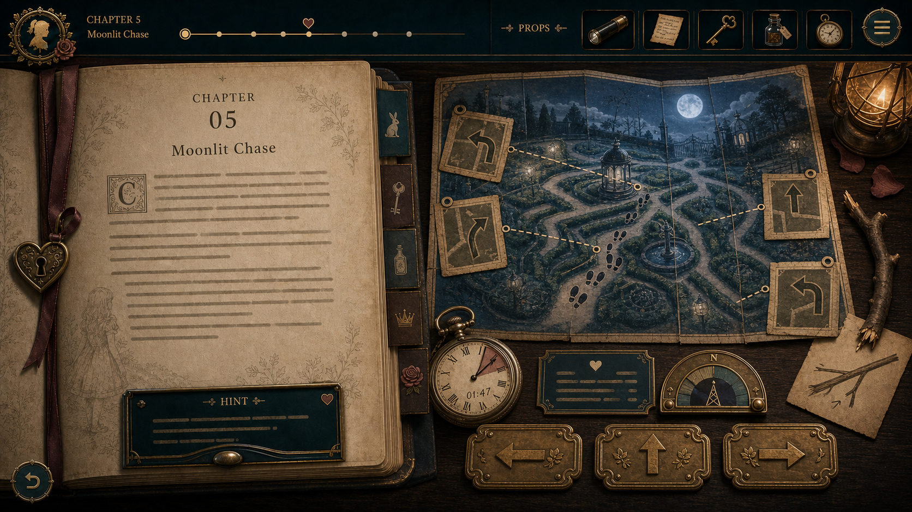
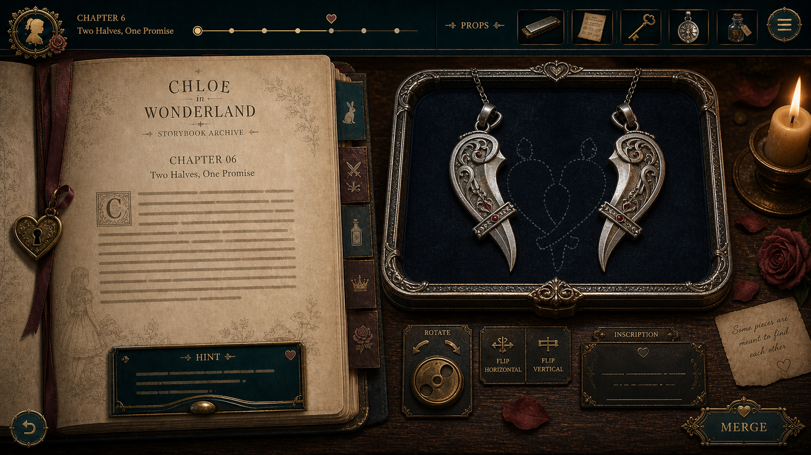
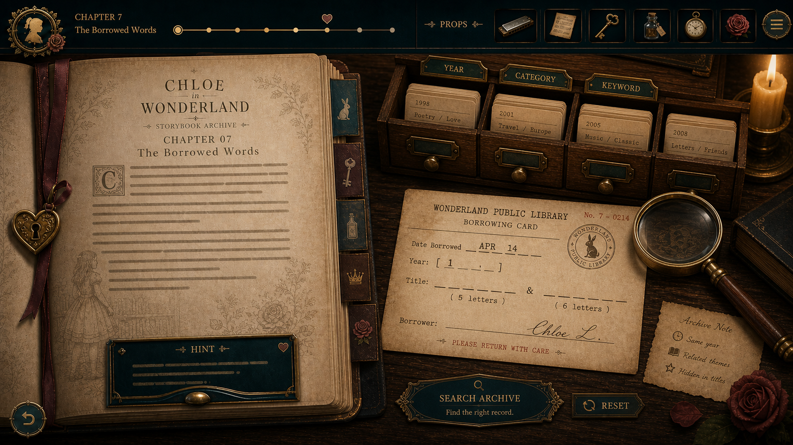
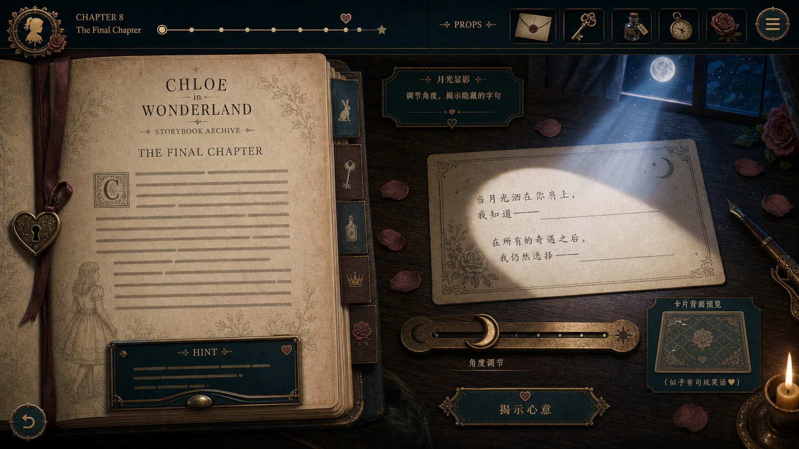

# Chloe in Wonderland GPT Visual Baseline

本文件记录当前选定的 GPT 视觉基准。后续 UI 实现不再凭空猜测，而是以这 8 张图作为统一审美参照。

## 选定方向

**Storybook Archive + Object Table**

一句话描述：

> 左侧是一本私人童话档案书，右侧是一张旧木桌上的真实解谜道具。

每一章都保持相同外层架构：

- 顶部是深墨绿色 HUD：章节标题、进度、已收集道具、菜单。
- 左侧是打开的故事档案书：章节叙事、提示抽屉、书签。
- 右侧是旧木桌道具区：每章一个核心可交互道具。
- 材质保持旧纸、黄铜、深绿、旧木、玫瑰红点缀。
- 章节差异来自道具、灯光和局部氛围，不来自整体 UI 重做。

## 基准图

### Chapter 1: 空之轨迹

保留重点：

- 左侧大开本旧书页。
- 顶部 HUD 的章节进度和道具栏。
- 右侧旧木桌、壁炉光、口琴、乐谱、木门锁。
- 黄铜 UI 装饰。
- 底部主操作按钮使用铭牌风格。

实现时注意：

- 文字必须由真实 HTML 渲染，不使用图中的伪文字。
- 第一章锁答案仍为 `7564`，不能照抄图中的数字。
- 右侧道具可以简化，但口琴、乐谱、四位滚轮锁必须保留。

### Chapter 2: 谁是骑士？

保留重点：

- 右侧是 7 张守卫证词卡，按 A-G 排列。
- 每张卡都有真、假、待定三态标记。
- 下方是当前假设板和逻辑检查区。
- 骑士徽章作为最终确认道具。
- 左侧故事书、提示抽屉和顶部 HUD 与第一章一致。

实现时注意：

- 卡片上的证词必须是真实文本，不能依赖图中伪文字。
- 第二章答案仍为 `G`。
- 交互重点是“推理桌”，不是普通选项按钮。

### Chapter 3: 码农天堂

保留重点：

- 右侧核心道具是复古终端和工作流机器。
- 任务节点按需求、设计、编码、测试、发布、礼物排列。
- 角色徽章放在下方，可分配到流程节点。
- 大号 `RUN` 按钮作为运行流程的主操作。
- 构建状态板用于表达成功或阻塞。

实现时注意：

- 可以先用 React 实现轻量拖拽，Phaser 只用于后续增强。
- 成功应表现为工作流跑通，而不是输入 `0222`。
- 绿色终端光要克制，保持和旧木桌统一。

### Chapter 4: 砖头

保留重点：

- Nokia 手机作为右侧绝对主角。
- 手机背面 `LOVE` 作为可翻看道具。
- 区号列表是一张桌上的旧纸条。
- 左侧故事书结构与其他章节一致。
- 道具栏和 HUD 风格持续统一。

实现时注意：

- 手机按键必须可点击。
- `C` 和 `#` 逻辑保留。
- 区号文本必须是真实可读文字。

### Chapter 5: 尾行

保留重点：

- 右侧是一张月夜花园路径地图。
- 路径、脚印、分岔路和方向卡共同构成追踪谜题。
- 底部方向按钮保持黄铜铭牌风格。
- 怀表或倒计时器提供追逐感。
- 灯光从暖木桌过渡到冷月光，但 HUD 仍保持统一。

实现时注意：

- 不做高压实时动作，保持轻量路径选择。
- 每一步都要有可观察线索，不要随机猜。
- 错误反馈可以表现为距离拉开或线索变淡。

### Chapter 6: 双剑合璧

保留重点：

- 右侧核心道具是两片银色挂饰。
- 深色绒布托盘承载旋转、翻面、合并操作。
- 半透明轮廓用于暗示目标形状。
- 下方是旋转、水平翻面、垂直翻面和合并按钮。
- 合拢后的铭文区为第七章做过渡。

实现时注意：

- 桌面可拖拽，移动端必须有按钮辅助旋转。
- 正确接近时需要磁吸感。
- 成功反馈是挂饰合拢和借阅卡出现。

### Chapter 7: 借阅卡

保留重点：

- 右侧是旧图书馆目录柜和借阅卡。
- 年份、类别、关键词分别像档案抽屉筛选器。
- 放大镜、档案纸条、印章强化检索感。
- 搜索按钮使用同一套黄铜铭牌。
- 玫瑰和蜡烛保持情感温度。

实现时注意：

- 年份 `2008` 和题名关键词必须按顺序验证。
- 借阅卡上的空缺是真实 HTML 输入或拨轮。
- 强化“所有”这个情感关键词，但完成前不要提前露出答案。

### Chapter 8: 莫奈的画

保留重点：

- 最终章变成夜色和月光，而不是继续暖色木屋。
- 右侧纸卡是情绪焦点。
- 月光角度滑杆可以做成黄铜月牙控制条。
- 卡片背面预览可以放在右下角。
- 底部主操作按钮要像装饰铭牌。

实现时注意：

- 正文答案仍为真实 HTML 输入或填空。
- 图中文字可作情绪参考，不能照抄为谜题答案。
- 最终显影要克制，不要炫光过度。

## 统一 UI 规则

### Layout

- 桌面端保持 `left storybook / right object table`。
- 左侧占约 `42%`，右侧占约 `58%`。
- 顶部 HUD 固定为同一结构。
- 右侧每章只突出一个核心道具。
- 移动端改为顶部 HUD、故事书、道具区的纵向堆叠。

### Color

核心色：

- Deep ink green / black: 用于 HUD 和装饰框。
- Warm paper: 用于故事页。
- Brass gold: 用于边框、按钮、进度节点。
- Old wood: 用于右侧桌面。
- Muted rose: 用于生日、爱意、最终章细节。
- Moon blue: 用于第 5 章和第 8 章的夜色变化。
- Terminal green: 仅用于第 3 章终端屏幕，不扩散成整章主色。

### Typography

- 标题：优雅 serif。
- 正文：清晰中文字体。
- UI 标签：小号 uppercase 或短中文标签。
- 不使用复杂花体作为正文。

### Buttons

按钮不再像普通网页按钮：

- 主按钮像黄铜铭牌。
- 次按钮像书签或纸签。
- 图标按钮像圆形金属按钮。
- 方向、旋转、播放、确认等操作优先用图标加短标签。

### Hints

提示应像书页底部抽屉或深绿色便签：

- 默认收起。
- 逐级展开。
- 记录提示使用次数。
- 不遮挡核心道具。

### Feedback

成功或失败反馈不要做普通 toast：

- 第一章：锁转动、木门打开。
- 第二章：守卫转身、徽章亮起。
- 第三章：工作流跑通、构建完成。
- 第四章：手机屏幕亮起、未接来电出现。
- 第五章：路径推进、距离变化、挂饰掉落。
- 第六章：挂饰磁吸合拢、铭文显现。
- 第七章：借阅卡补全、档案盖章。
- 第八章：卡片显影、兑换券出现。

## 实现优先级

1. 先重构外层 HUD、故事书、右侧道具桌，使 8 章共享同一套布局。
2. 再逐章迁移核心道具，不为每章单独发明一套页面结构。
3. 优先完成 Chapter 1、2、4、8，验证基础交互和情绪收束。
4. 再完成 Chapter 3、5、6、7，补齐较复杂的拖拽、路径和检索玩法。
5. 最后做移动端适配、动画节奏、音效和资源本地化。

## 不要做的事

- 不要继续随机调 Tailwind 颜色。
- 不要继续堆更多白色卡片。
- 不要把 AI 图当成最终素材直接铺背景。
- 不要牺牲交互可读性去追求复杂装饰。
- 不要让道具遮挡故事文本。
- 不要让每章变成完全不同的网站。
